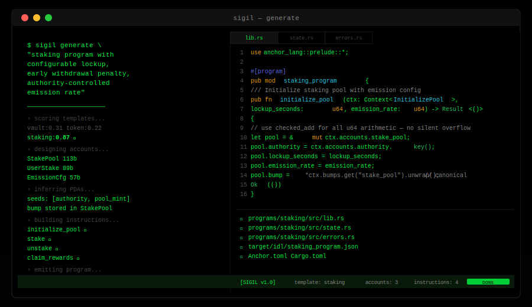

# Sigil


**Describe a Solana program. Sigil writes the code.**

Sigil is an AI agent that turns plain-English descriptions into complete, production-ready Solana Anchor programs — Rust source, IDL, Cargo.toml, Anchor.toml, all of it.

---

## Generate From the CLI



One command. Describe what you want to build. Sigil's Claude agent reasons through the architecture — scoring templates, computing exact account space, inferring PDA seeds — then emits compilable Anchor Rust in real time.

Every generation produces a complete Anchor project: Rust source split by instruction, on-chain account structs with exact space, a valid IDL, and the config files needed to build and deploy.

---

## How It Works

```
Description → Claude agent loop → program design → code emitter → Anchor project
```

The agent runs a structured 4-step loop:

1. **select_template** — matches your description to the closest base template (staking, vault, token, NFT, governance)
2. **design_accounts** — defines on-chain account structs with typed fields and PDA seeds
3. **design_instructions** — defines instruction handlers with args, account requirements, and error codes
4. **emit_program** — assembles the final validated program design

Then the emitter turns the design into real Rust.

---

## Quick Start

```bash
git clone https://github.com/your-org/sigil
cd sigil
bun install
cp .env.example .env   # add ANTHROPIC_API_KEY
bun run build

# generate a program
sigil generate "Create a token staking program with 7-day lockup and 15% APY"
```

---

## Examples

```bash
# Staking program
sigil generate "Token staking with 30-day lockup and proportional rewards"

# DAO governance
sigil generate "DAO governance with proposal voting, quorum, and timelock execution"

# NFT collection
sigil generate "NFT collection with royalty enforcement and allow-list minting"

# Treasury vault
sigil generate "Multi-sig treasury vault with spending limits and time locks"
```

---

## Templates

| Template | Description |
|---|---|
| `staking` | Token lockup + APY rewards |
| `vault` | Multi-sig treasury |
| `token` | SPL mint + authority controls |
| `nft` | Collection + royalties |
| `governance` | DAO voting + timelock |
| `custom` | Full free-form generation |

---

## Project Structure

```
sigil/
├── agent/           Claude 4-step design loop + system prompt
├── builder/         Rust struct + instruction + program assembler
├── templates/       5 base templates + keyword matcher
├── emitter/         IDL, Cargo.toml, Anchor.toml generators
├── validator/       Design validation before emit
├── cli/             sigil generate CLI command
├── schemas/         Zod input validation
├── lib/             Config + logger + types
├── examples/        Runnable generation examples
├── tests/           Unit tests (Vitest)
└── docs/            Template reference
```

---

## Configuration

| Variable | Default | Description |
|---|---|---|
| `ANTHROPIC_API_KEY` | — | Required |
| `CLAUDE_MODEL` | `claude-opus-4-6` | Model |
| `OUTPUT_DIR` | `./output` | Where to write generated programs |
| `SOLANA_CLUSTER` | `devnet` | Target cluster for Anchor.toml |
| `ANCHOR_VERSION` | `0.31.0` | Anchor version in generated Cargo.toml |

---

## Technical Spec

### Anchor Account Space Calculation

Sigil computes exact `space` parameters for every `#[account]` struct to avoid realloc failures at runtime:

```
space = 8 (discriminator) + Σ field_sizes
```

Field encoding rules Sigil enforces:

| Rust Type | On-chain bytes | Notes |
|-----------|---------------|-------|
| `u64` / `i64` | 8 | |
| `Pubkey` | 32 | |
| `bool` | 1 | |
| `String` | `4 + len` | 4-byte length prefix — **not flat 64** |
| `Vec<T>` | `4 + n × item_size` | 4-byte length prefix + element array |
| `Option<T>` | `1 + item_size` | 1-byte discriminant |

A flat `64` for `String` is one of the most common space bugs in Anchor programs. Sigil catches it at design time.

### PDA Canonical Bump Storage

Generated programs store the canonical bump seed in the account struct:

```rust
pub bump: u8,  // canonical bump — stored to save ~20k CU vs re-derivation
```

Re-deriving the bump via `find_program_address` costs ~20,000 compute units. Storing it at init and passing it back in subsequent instructions is the standard Anchor pattern; Sigil enforces it.

### Instruction Discriminators

Anchor computes the discriminator as:
```
sha256("global:<instruction_name>")[..8]
```

Duplicate instruction names in the same program cause a **compile-time panic** in Anchor (not a runtime error). Sigil's validator checks for duplicates and surfaces the error before code is emitted.

### Checked Arithmetic

All generated `u64` arithmetic uses `checked_add` / `checked_sub`:

```rust
// NOTE: use checked_add/checked_sub for all u64 arithmetic.
// Rust does not panic on integer overflow in release builds — silent wrap is a common exploit vector.
```

Solana release builds compile with `overflow-checks = false` by default. Silent integer wrap has been exploited in production programs. Sigil generates safe code by default.

### Signer Validation

Sigil's validator scans every instruction for unsigned state mutation:

```
if mutatesState && !hasSigner → warning: "Instruction mutates state but has no apparent signer"
```

Instructions that write to accounts without a signing authority are a common access control vulnerability. The warning is surfaced before emit.

---

## License

MIT


