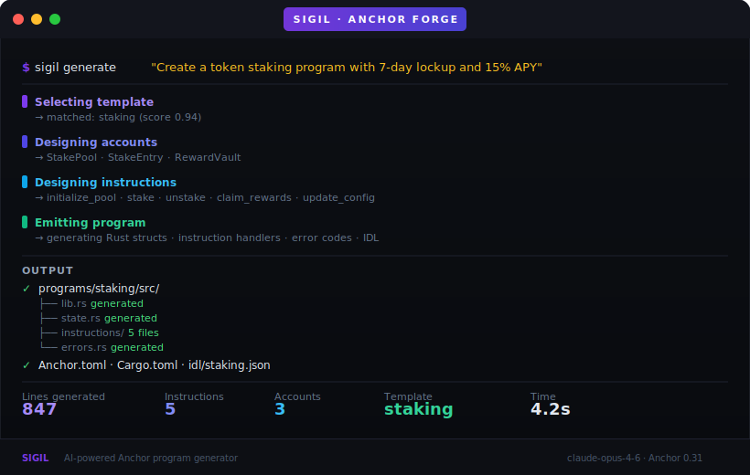
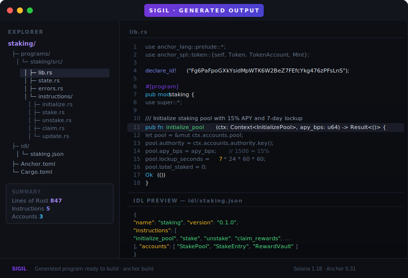

# Sigil


**Describe a Solana program. Sigil writes the code.**

Sigil is an AI agent that turns plain-English descriptions into complete, production-ready Solana Anchor programs — Rust source, IDL, Cargo.toml, Anchor.toml, all of it.

---

## Generate From the CLI



One command. Describe what you want to build. Sigil's Claude agent reasons through the architecture, picks the right template, designs the accounts and instructions, and emits compilable code.

---

## Inspect the Output



Every generation produces a complete Anchor project: Rust source split by instruction, on-chain account structs with space estimates, a valid IDL, and the config files you need to build and deploy.

---

## How It Works

```
Description → Claude agent loop → program design → code emitter → Anchor project
```

The agent runs a structured 4-step loop:

1. **select_template** — matches your description to the closest base template (staking, vault, token, NFT, governance)
2. **design_accounts** — defines on-chain account structs with typed fields and PDA seeds
3. **design_instructions** — defines instruction handlers with args, account requirements, and error codes
4. **emit_program** — assembles the final validated program design

Then the emitter turns the design into real Rust.

---

## Quick Start

```bash
git clone https://github.com/your-org/sigil
cd sigil
bun install
cp .env.example .env   # add ANTHROPIC_API_KEY
bun run build

# generate a program
sigil generate "Create a token staking program with 7-day lockup and 15% APY"
```

---

## Examples

```bash
# Staking program
sigil generate "Token staking with 30-day lockup and proportional rewards"

# DAO governance
sigil generate "DAO governance with proposal voting, quorum, and timelock execution"

# NFT collection
sigil generate "NFT collection with royalty enforcement and allow-list minting"

# Treasury vault
sigil generate "Multi-sig treasury vault with spending limits and time locks"
```

---

## Templates

| Template | Description |
|---|---|
| `staking` | Token lockup + APY rewards |
| `vault` | Multi-sig treasury |
| `token` | SPL mint + authority controls |
| `nft` | Collection + royalties |
| `governance` | DAO voting + timelock |
| `custom` | Full free-form generation |

---

## Project Structure

```
sigil/
├── agent/           Claude 4-step design loop + system prompt
├── builder/         Rust struct + instruction + program assembler
├── templates/       5 base templates + keyword matcher
├── emitter/         IDL, Cargo.toml, Anchor.toml generators
├── validator/       Design validation before emit
├── cli/             sigil generate CLI command
├── schemas/         Zod input validation
├── lib/             Config + logger + types
├── examples/        Runnable generation examples
├── tests/           Unit tests (Vitest)
└── docs/            Template reference
```

---

## Configuration

| Variable | Default | Description |
|---|---|---|
| `ANTHROPIC_API_KEY` | — | Required |
| `CLAUDE_MODEL` | `claude-opus-4-6` | Model |
| `OUTPUT_DIR` | `./output` | Where to write generated programs |
| `SOLANA_CLUSTER` | `devnet` | Target cluster for Anchor.toml |
| `ANCHOR_VERSION` | `0.31.0` | Anchor version in generated Cargo.toml |

---

## License

MIT
